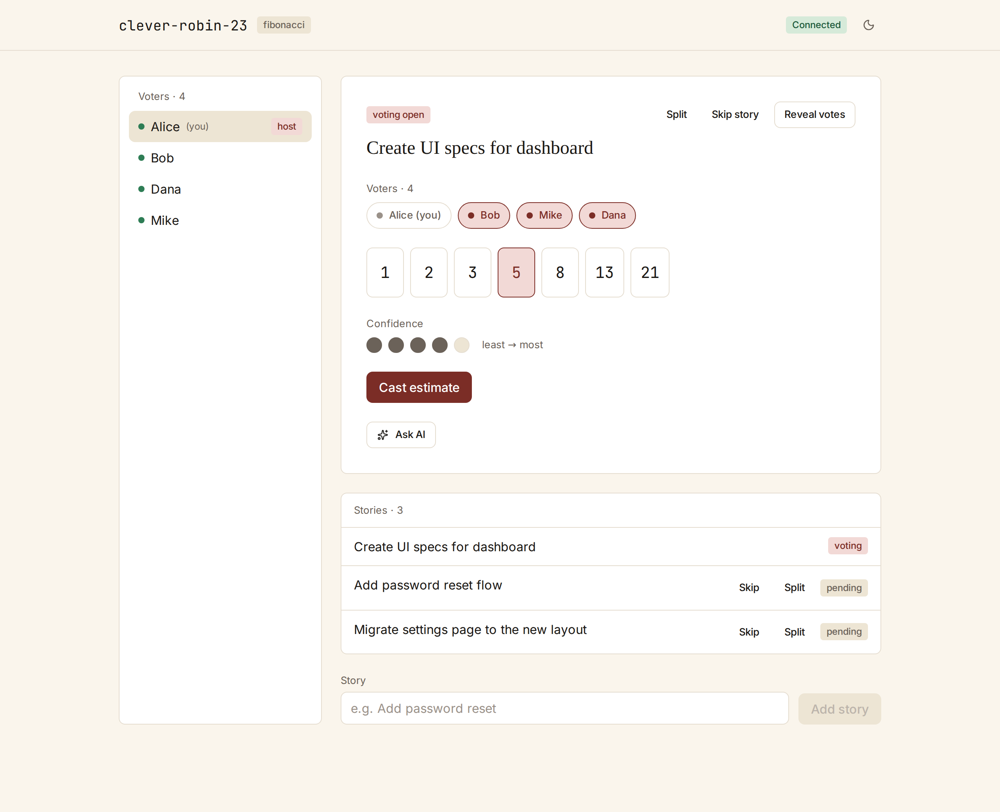
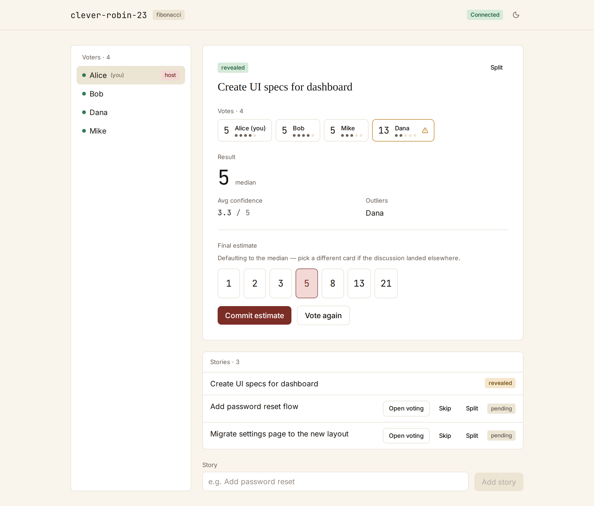

# Pointe

Estimate with precision.

Free, open-source planning poker that takes estimation seriously — anti-anchoring by design, with confidence and async built in. Not another 2012-era voting clone.

[pointe.team](https://pointe.team) · MIT-licensed · no accounts, no ads

<picture>
  <source media="(prefers-color-scheme: dark)" srcset="docs/hero-voting-dark.png">
  
</picture>

## The problem

Most planning poker tools reveal everyone's number at once and call it done. Three failure modes survive that, and they're the ones that actually cost teams:

- **Anchoring.** The senior voice votes first, or loudest, and the team quietly clusters around it. The estimate you get is the room's deference, not its judgment.
- **Wasted sync meetings.** An hour of refinement spent walking through stories nobody actually disagreed about — the consensus was there from the first reveal.
- **False consensus.** "5 points, sure" and "5 points, guessing" look identical on the table. The difference shows up later, when velocity tanks and nobody knows why.

Pointe is built to address these three deliberately, not to render cards faster.

## What makes it different

<picture>
  <source media="(prefers-color-scheme: dark)" srcset="docs/hero-reveal-dark.png">
  
</picture>

**Anti-anchoring AI.** Opt-in, per story. When the host asks for it, Claude reasons across Cohn's four estimation dimensions — complexity, effort, risk, unknowns — and offers an independent range. It stays hidden until reveal, so it can't anchor the room, and it never casts a vote or overrides the team. It's a second opinion that arrives after yours, not before.

**Async and outlier surfacing.** Open a room in async mode and the team votes within a window instead of a meeting. At close, votes auto-reveal and only the outliers surface for discussion. A 60-minute refinement becomes a 10-minute review of the handful of stories that genuinely split the room.

**Confidence as a first-class signal.** Every vote is two values: points and confidence, 1 to 5. Reveal shows both. When the team's average confidence is low, the story is flagged as one that may need more refinement before it's committed — false certainty caught at the table, not in the sprint.

## How it works

1. Create a room and pick a deck.
2. Share the link with your team.
3. Everyone votes — points and confidence, privately.
4. Reveal. The room sees the median, the spread, and any outliers.
5. Commit the estimate, or send the outliers to discussion.

No accounts. Voters don't install anything — they open a link.

## Principles

- **Built by a practitioner.** Pointe is built by a working Senior Scrum Master, against the problems that show up in real refinements — not a feature checklist.
- **Free forever.** MIT-licensed, no freemium tier, no upsell, no ads. Supported by optional donations, never gated behind them.
- **Open source from day one.** The whole thing is in the open, including how it's built.
- **No accounts, no harvesting.** No sign-up, no personal data, cookieless analytics. Rooms are ephemeral — their links expire after a period of inactivity.

## Built on

- **Web:** React, Vite, TypeScript, Tailwind.
- **Backend:** Cloudflare Workers, Durable Objects, SQLite, WebSocket Hibernation.
- **AI:** Anthropic Claude.

One strongly consistent Durable Object per room — an authoritative actor per session, not a shared database the whole app contends over. The architecture is correct by design.

## Roadmap

v1 is shipped: the full estimation loop, opt-in AI, async windows, and the confidence dimension are live. v1.5 and v2 directions are worked in the open. Open issues are the roadmap signal — feature requests and real-world feedback shape what lands next.

## Local development

Prerequisites: Node 20+ and pnpm 10+.

```bash
git clone https://github.com/jderomanis1/pointe.git
cd pointe
pnpm install

# Web app (http://localhost:5173)
pnpm -F @pointe/web dev

# API worker (http://localhost:8787)
pnpm -F @pointe/worker dev

# Quality checks (also enforced in CI)
pnpm lint
pnpm typecheck
```

## Contributing

Pull requests are welcome — keep them small and focused, with a short note on intent. Lint and typecheck run in CI, so run `pnpm lint` and `pnpm typecheck` first. Issues are roadmap signal: feature requests and real-world feedback are the most useful thing you can send.

## License

[MIT](LICENSE).

---

Built by Joe DeRomanis. [github.com/jderomanis1](https://github.com/jderomanis1)
